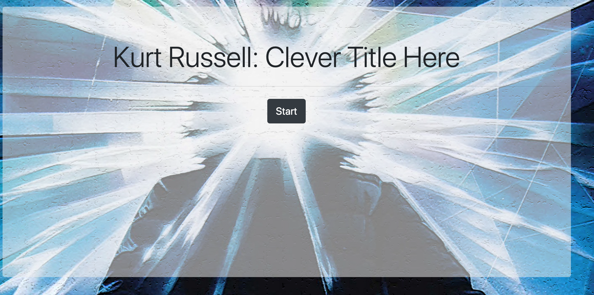
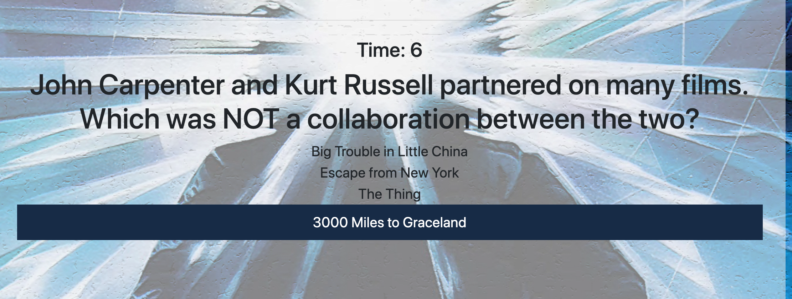

# Kurt Russell Trvia 👽🥋🛥

### Welcome

Created a Trivia game using JavaScript for the logic and jQuery to manipulate HTML. How well do you know Kurt?

### Have you played a Trivia Game Before?

The basis is simple:

* Trivia game shows only one question until the player answers it or their time runs out.

* If the player selects the correct answer, CONGRATULATIONS.

* If the player selects the wrong answer, well, I'm very sorry.  Please come again.

* On the final screen, you will see the number of correct answers, incorrect answers, and an option to restart the game (without reloading the page).

#

<kbd>
  
</kbd>

#

<kbd>
  
</kbd>
